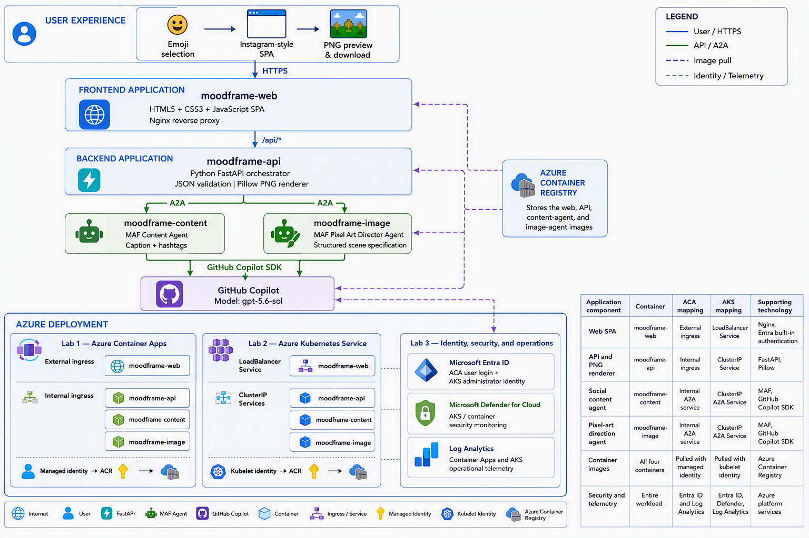

# Rapid Multi-Agent Cloud-Native Deployment Hands-on Lab

This repository is a story-driven, one-hour workshop about taking a small social mood-sharing agent application from a developer laptop to Azure.



## Project architecture

MoodFrame uses a separated frontend and backend. After the user selects an emoji, FastAPI calls two independently deployed Microsoft Agent Framework agents through A2A. Both agents use GitHub Copilot SDK with `gpt-5.6-sol`; Pillow turns the image agent's structured art direction into a downloadable pixel-polaroid PNG containing the generated caption and hashtags.

```text
┌─────────────────────────────────────────────────────────────────────────────┐
│                              USER EXPERIENCE                                │
│  Browser → Emoji selection → Instagram-style SPA → PNG preview/download    │
└───────────────────────────────────┬─────────────────────────────────────────┘
                                    │ HTTPS
┌───────────────────────────────────▼─────────────────────────────────────────┐
│                         FRONTEND APPLICATION                                │
│  moodframe-web                                                              │
│  HTML5 + CSS3 + JavaScript SPA │ Nginx reverse proxy                       │
└───────────────────────────────────┬─────────────────────────────────────────┘
                                    │ /api/*
┌───────────────────────────────────▼─────────────────────────────────────────┐
│                         BACKEND APPLICATION                                 │
│  moodframe-api                                                              │
│  Python FastAPI orchestrator │ JSON validation │ Pillow PNG renderer       │
└───────────────────────┬─────────────────────────┬───────────────────────────┘
                        │ A2A                     │ A2A
          ┌─────────────▼─────────────┐  ┌────────▼─────────────────────────┐
          │ moodframe-content         │  │ moodframe-image                 │
          │ MAF Content Agent         │  │ MAF Pixel Art Director Agent    │
          │ Caption + hashtags        │  │ Structured scene specification  │
          └─────────────┬─────────────┘  └────────┬─────────────────────────┘
                        └──────────────┬────────────┘
                                       │ GitHub Copilot SDK
                          ┌────────────▼────────────┐
                          │ GitHub Copilot          │
                          │ Model: gpt-5.6-sol      │
                          └─────────────────────────┘

┌──────────────────────────── AZURE DEPLOYMENT ───────────────────────────────┐
│                                                                             │
│  Azure Container Registry                                                  │
│  └── Stores the web, API, content-agent, and image-agent images            │
│                                                                             │
│  Lab 1 — Azure Container Apps              Lab 2 — Azure Kubernetes Service│
│  ┌──────────────────────────────┐           ┌──────────────────────────────┐ │
│  │ External ingress            │           │ LoadBalancer Service         │ │
│  │ └── moodframe-web           │           │ └── moodframe-web           │ │
│  │ Internal ingress            │           │ ClusterIP Services           │ │
│  │ ├── moodframe-api           │           │ ├── moodframe-api           │ │
│  │ ├── moodframe-content       │           │ ├── moodframe-content       │ │
│  │ └── moodframe-image         │           │ └── moodframe-image         │ │
│  │ Managed identity → ACR      │           │ Kubelet identity → ACR      │ │
│  └──────────────────────────────┘           └──────────────────────────────┘ │
│                                                                             │
│  Lab 3 — Identity, security, and operations                                 │
│  ├── Microsoft Entra ID → ACA user login + AKS administrator identity      │
│  ├── Microsoft Defender for Cloud → AKS/container security monitoring      │
│  └── Log Analytics → Container Apps and AKS operational telemetry          │
└─────────────────────────────────────────────────────────────────────────────┘
```

| Application component | Container | ACA mapping | AKS mapping | Supporting technology |
|---|---|---|---|---|
| Web SPA | `moodframe-web` | External ingress | LoadBalancer Service | Nginx, Entra built-in authentication |
| API and PNG renderer | `moodframe-api` | Internal ingress | ClusterIP Service | FastAPI, Pillow |
| Social content agent | `moodframe-content` | Internal A2A service | ClusterIP A2A Service | MAF, GitHub Copilot SDK |
| Pixel-art direction agent | `moodframe-image` | Internal A2A service | ClusterIP A2A Service | MAF, GitHub Copilot SDK |
| Container images | All four containers | Pulled with managed identity | Pulled with kubelet identity | Azure Container Registry |
| Security and telemetry | Entire workload | Entra ID and Log Analytics | Entra ID, Defender, Log Analytics | Azure platform services |

### Repository layout

```text
.
├── code/
│   ├── agents/          # Content and image MAF A2A agents
│   ├── backend/         # FastAPI orchestration and PNG rendering
│   ├── frontend/        # HTML5/CSS3/JavaScript SPA
│   ├── infra/
│   │   ├── aca/         # Container Apps Bicep and deployment scripts
│   │   ├── aks/         # AKS Bicep and Kubernetes manifests
│   │   └── security/    # Entra ID and Defender scripts
│   ├── scripts/         # Local environment scripts
│   └── tests/           # Python tests
├── labs/
│   ├── en/              # English labs
│   └── cn/              # Chinese labs
└── README.zh.md
```

## Workshop path

| Lab | Story milestone | Time |
|---|---|---:|
| [Lab 0](labs/en/00-prepare-your-environment.md) | Join the MoodFrame team and prepare the workstation | 10 min |
| [Lab 1](labs/en/01-deploy-to-aca.md) | Launch the first cloud version with Azure Container Apps | 15 min |
| [Lab 2](labs/en/02-deploy-to-aks.md) | Move the service to AKS for Kubernetes control | 20 min |
| [Lab 3](labs/en/03-secure-with-entra-and-defender.md) | Add identity and cloud-native security | 15 min |

Application source and deployment assets are under [`code/`](code/). Complete the labs from the repository root, then run application and deployment commands inside `code/`.

Chinese version: [README.zh.md](README.zh.md)
